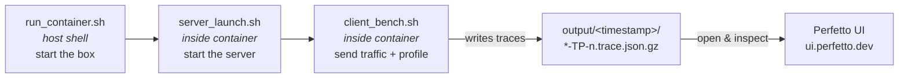

# SGLang Profiling Tutorial

A personal, beginner-first cheat sheet for profiling [SGLang](https://github.com/sgl-project/sglang)
serving on Nvidia (CUDA / B200) GPUs. If you forget the steps, **just read this top to bottom** —
it is written so you can re-learn the whole flow in a few minutes.

---

## 1. The big picture (read this first)

Profiling SGLang has **three moving parts**, run in this order:



1. **`run_container.sh`** — starts a Docker container that has SGLang + CUDA pre-installed,
   and mounts your model files, this project folder, and (optionally) your SGLang source.
2. **`server_launch.sh`** — inside that container, boots the SGLang inference server
   (loads the model, opens the API on a port).
3. **`client_bench.sh`** — inside the container, fires benchmark traffic at the server
   **with profiling turned on**. The profiler writes trace files into `output/`.

Then you open the trace files in a viewer (Perfetto) to see where time is spent.

> Mental model: the **server** is the thing you profile; the **client** is what makes it
> do work so there's something to profile.

---

## 2. Prerequisites (don't skip)

- An Nvidia GPU host (B200) with the NVIDIA Container Toolkit installed (so `docker run --gpus` works).
- Docker installed and your user able to run it.
- The model weights already present in the local HF-hub cache at
  `/models/models--Qwen--Qwen3.5-397B-A17B-FP8/snapshots/<hash>/` on the host.
- Enough disk space in `output/` — **each trace is ~100 MB per GPU (TP rank)**, so a single
  4-GPU run produces ~400 MB. These fill up fast.

---

## 3. Step-by-step

### Step 0 — Know your key settings

These values must **match across scripts** or nothing connects:

| Setting        | Where it's set                         | Current value                               |
|----------------|-----------------------------------------|---------------------------------------------|
| Model path     | all scripts (`MODEL` / `MODELS_DIR`)   | `/models/models--Qwen--Qwen3.5-397B-A17B-FP8/snapshots/ea5b4f81096f3901c91dea97f81324302495781d/` |
| Port           | `server_launch.sh` + `client_bench.sh` | `9001`                                       |
| TP (GPUs)      | `server_launch.sh` (`--tp`)             | `4`                                           |
| Output dir     | `client_bench.sh` (`--profile-output-dir`) | `/workspace/profiling/output`           |

> **Easy-to-forget rule #1:** the client `PORT` must equal the server `--port`.
> **Easy-to-forget rule #2:** paths like `/workspace/profiling` are the paths *inside* the
> container (see the volume mounts below), not on the host.

### Step 1 — Start the container (on the host)

```bash
./run_container.sh
```

This drops you into a shell **inside** the container at `/workspace/profiling`.
Key things it does (from `run_container.sh`):

- Image: `lmsysorg/sglang:v0.5.14-cu130` (SGLang + CUDA 13.0, B200-ready).
- Passes GPUs into the container (`--gpus '"device=0,1,2,3"'` — only 4 of the 8 GPUs on the box, matching TP=4).
- `--cap-add=SYS_PTRACE` + `--security-opt seccomp=unconfined` — **required for profiling**
  (the profiler needs to trace the process). Don't remove these.
- Volume mounts (host path → container path):
  - `/models` → `/models` (HF-hub cache with the model weights)
  - `$HOME/workspace/sglang-profiling-tutorial` → `/workspace/profiling` (this repo; traces land here so
    you can see them on the host too)
  - `$HOME/workspace/sglang` → `/workspace/sglang` (optional: your own SGLang source)
- Publishes port `9001`.

> **Tip:** To profile *your own* modified SGLang instead of the version baked into the image,
> run `pip install -e .` inside `/workspace/sglang` after the container starts.

### Step 2 — Launch the server (inside the container)

Open a shell in the container and run:

```bash
./server_launch.sh
```

Wait until you see the server report it is ready / listening on port `9001`.
Notable flags (from `server_launch.sh`):

- `--tp 4 --ep-size 1` — tensor-parallel across 4 GPUs (`CUDA_VISIBLE_DEVICES=0,1,2,3`), no separate expert parallelism.
- `--attention-backend trtllm_mha` + `--moe-runner-backend flashinfer_trtllm` — Nvidia TensorRT-LLM/FlashInfer kernels for B200.
- `--quantization fp8 --kv-cache-dtype fp8_e4m3` — matches the FP8 checkpoint and uses FP8 KV cache.
- `--mamba-ssm-dtype bfloat16` — Qwen3.5's hybrid linear-attention (mamba-style) layers run in bf16.
- `--enable-symm-mem` — NCCL symmetric memory for faster collectives on B200/NVLink.
- `--disable-radix-cache` — turns off prefix caching so benchmark numbers are clean
  and repeatable (no cache hits skewing results).
- `--mem-fraction-static 0.9` — reserve 90% of VRAM for the model/KV cache.
- `--chunked-prefill-size 32768`, `--max-running-requests 512`, `--page-size 16` — throughput/
  batching knobs.

> **Easy-to-forget rule #3:** the server and client run in the **same container** (or at least
> can reach each other on `localhost:9001`). Use a second terminal into the container
> (`docker exec -it wesley-sglang-profiling-kickstart bash`) for the client.

### Step 3 — Run the benchmark + profile (inside the container)

Once the server is up:

```bash
./client_bench.sh
```

What it does (from `client_bench.sh`):

- Runs `python3 -m sglang.bench_serving` against `localhost:9001`.
- `--dataset-name random` with `--random-input-len 8192 --random-output-len 1024` — synthetic prompts
  of 8192 input tokens and 1024 output tokens.
- `--max-concurrency 4` and `num_prompts = concurrency * 2` — how much load to apply.
- **`--profile`** — this is the switch that turns on the Torch profiler.
- **`--profile-output-dir /workspace/profiling/output`** — where trace files are written.

After it finishes, look in `output/<timestamp>/`:

- `*-TP-<n>.trace.json.gz` — the profiler trace, **one per GPU/TP rank** (this is the main artifact).
- `sglang_*.jsonl` — per-request benchmark records.
- `bench_results.csv` — summary (concurrency, median latency, throughput).
- `server-mode_benchmark_results_*.log` — the client run log.

---

## 4. Viewing the traces

The `.trace.json.gz` files are Chrome/Torch trace format. To view:

1. Go to **[https://ui.perfetto.dev](https://ui.perfetto.dev)** (or `chrome://tracing`).
2. Open the `.trace.json.gz` file directly (Perfetto reads gzipped JSON).
3. Look for the timeline of GPU kernels, gaps (idle time = opportunity), and the
   biggest/most-frequent ops.

> Because traces are per-TP-rank, open the rank you care about (e.g. `TP-0`). Comparing ranks
> can reveal load imbalance.

---

## 5. Common gotchas / things I forget

- **Nothing gets profiled if you forget `--profile`** on the client. It runs fine, just no traces.
- **Server port ≠ client port** → connection refused. Both are `9001` here.
- **`output/` gets huge.** Traces are ~100 MB × number of GPUs *per run*. Clean out old
  `output/<timestamp>/` folders you don't need. (They're git-ignored, so they never get pushed.)
- **Profiling needs `SYS_PTRACE` / `seccomp=unconfined`** — already in `run_container.sh`.
  If profiling silently produces nothing, check these weren't removed.
- **Results not repeatable?** Make sure `--disable-radix-cache` is on so prefix caching
  doesn't create fake speedups between runs.
- **Container name** is `wesley-sglang-profiling-kickstart`; use it with `docker exec` to open
  extra shells.
- **Paths are container paths.** `/workspace/profiling` inside == `$HOME/workspace/sglang-profiling-tutorial`
  on the host.
- **`sglang.bench_serving` flags changed between versions** — this image's build wants
  `--random-input-len` / `--random-output-len`, not the older `--random-input` / `--random-output`.

---

## 6. Files in this repo

| File               | What it is                                                        |
|--------------------|-------------------------------------------------------------------|
| `run_container.sh` | Starts the CUDA SGLang Docker container with the right mounts/caps. |
| `server_launch.sh` | Launches the SGLang inference server (model, TP, backend, port).  |
| `client_bench.sh`  | Sends benchmark traffic **with profiling** and saves traces.      |
| `output/`          | Profiling/benchmark results (git-ignored — never pushed).         |

---

## 7. Quick reference (copy/paste flow)

```bash
# 1. On the host: start the container
./run_container.sh

# 2. Inside the container (terminal A): start the server, wait until ready
./server_launch.sh

# 3. Inside the container (terminal B): run the profiled benchmark
docker exec -it wesley-sglang-profiling-kickstart bash   # (from host, to get terminal B)
./client_bench.sh

# 4. On the host: open output/<timestamp>/*-TP-0.trace.json.gz in https://ui.perfetto.dev
```
